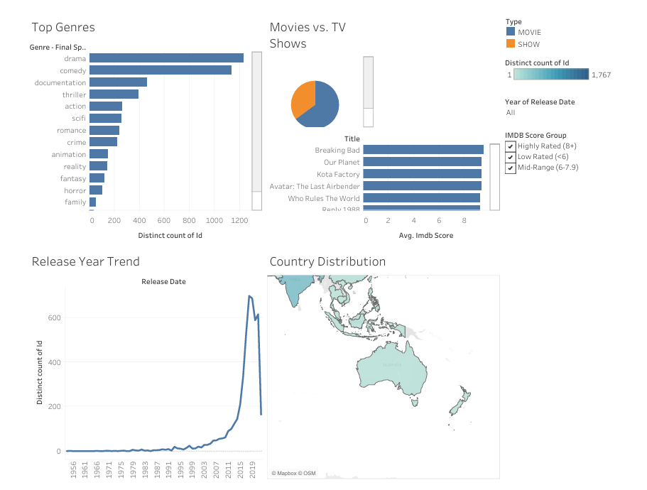

# 🍿 Netflix Content Strategy & Distribution Dashboard

## Overview
An interactive Tableau dashboard using a public Netflix Movies & TV Shows dataset to explore content distribution, popularity, and global availability. This project analyzes over 4,900 titles to uncover trends in how Netflix's library has expanded over time and which categories produce the highest-rated content.

## Dashboard Demonstration

## 📊 Key Results & Visualizations
The dashboard includes the following visual insights:
* **Content Balance:** A clear breakdown of Movies vs. TV Shows to understand the catalog balance.
* **Top Genres & Ratings:** Genre and IMDb score analysis highlighting which categories produce higher-rated content.
* **Release Year Trend:** A time-series analysis showing how Netflix’s library has expanded over time.
* **Global Footprint:** A geographic country map revealing where most content is produced globally.

## 💡 Business Impact
Although created as a foundational project, this dashboard reflects real-world reporting practices and effective storytelling through data. It demonstrates:
* **Technical Proficiency:** The ability to use Tableau to clean data, build visual insights, and create interactive filtering.
* **Strategic Value:** How data dashboards can support business decisions in content strategy, quality analysis, and global distribution planning.

## 📂 Files in this Repository
* `my_data_export.csv` - The underlying dataset used for the analysis.
* `Dashboard 1.pdf` - A static PDF export of the final dashboard view.
* `README.md` - Project documentation.

## 🛠️ Tools Used
* **Data Visualization:** Tableau
* **Data Source:** Public Netflix Dataset
